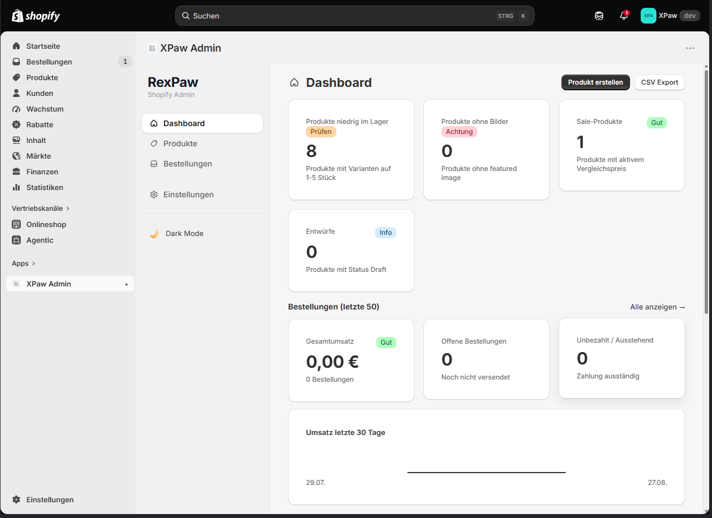
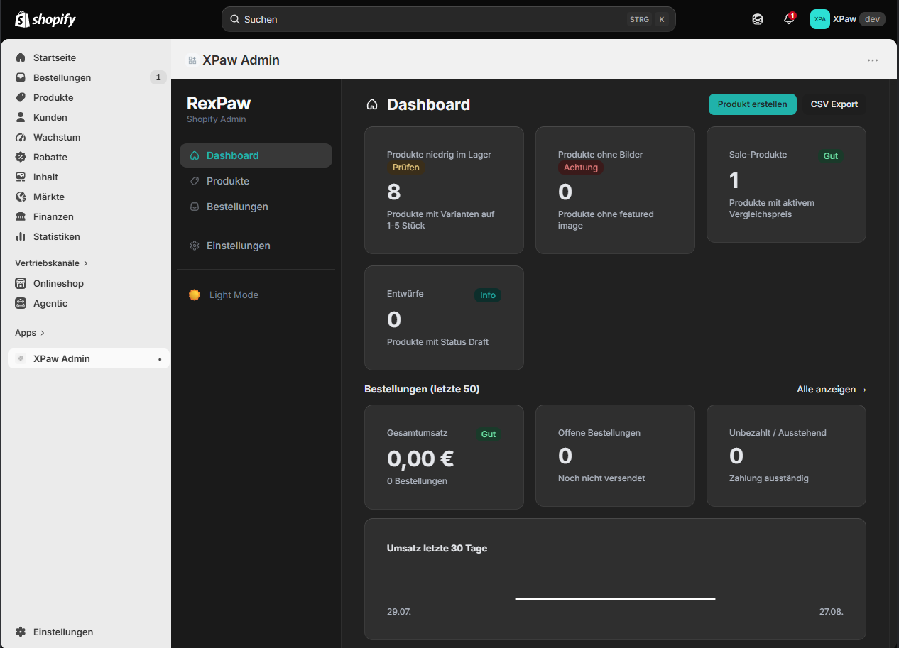
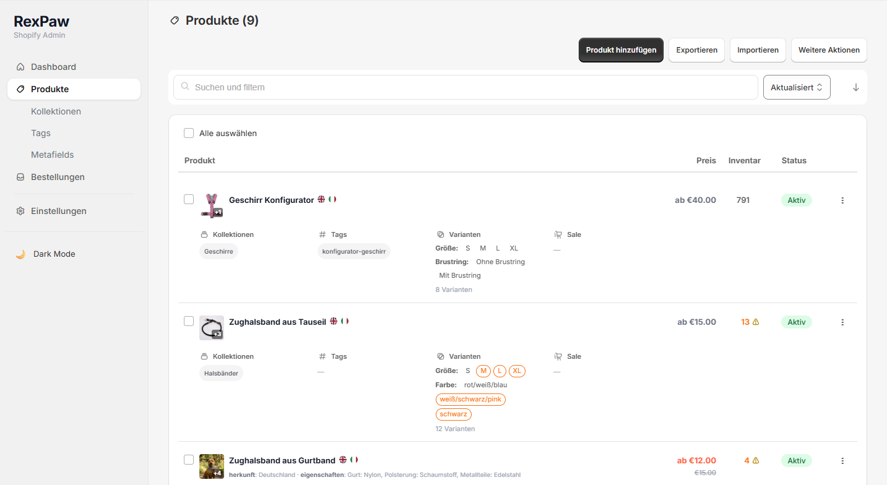
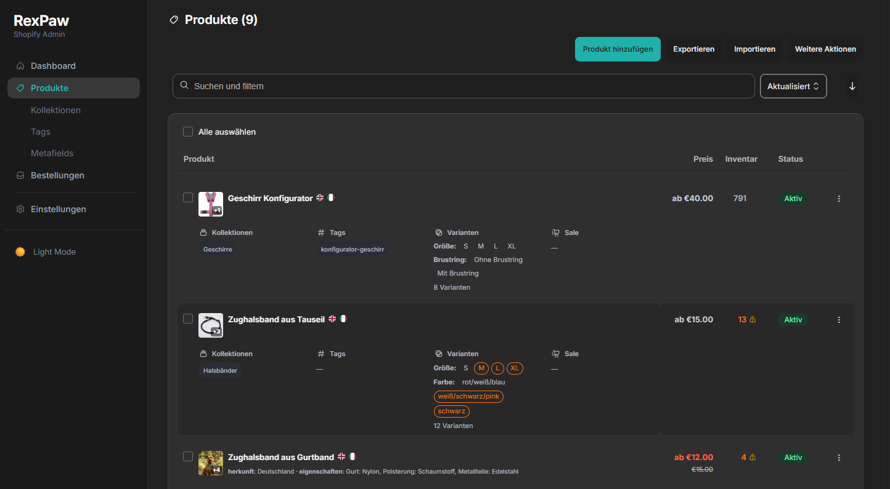
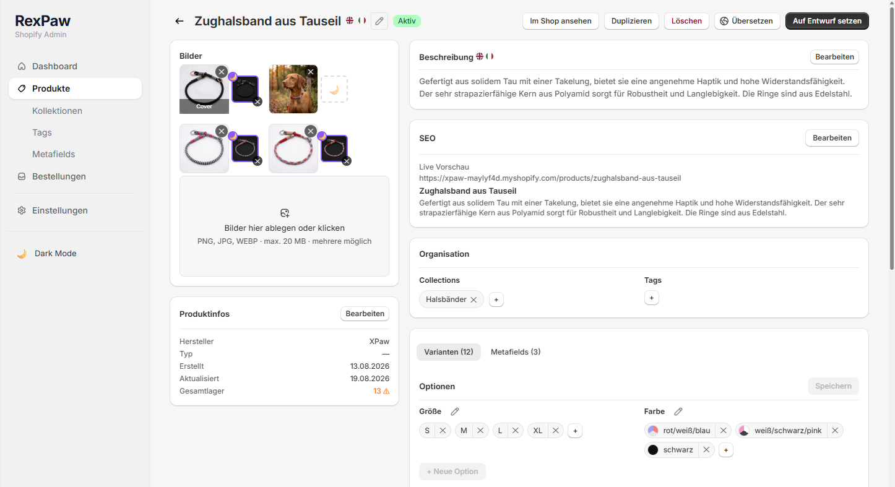
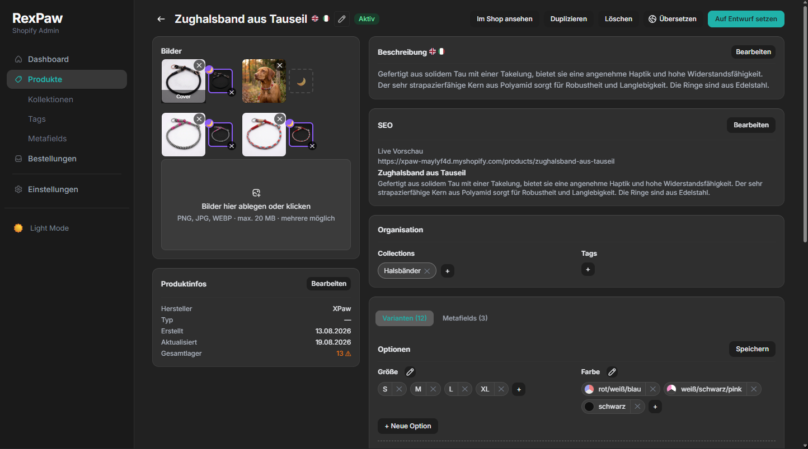
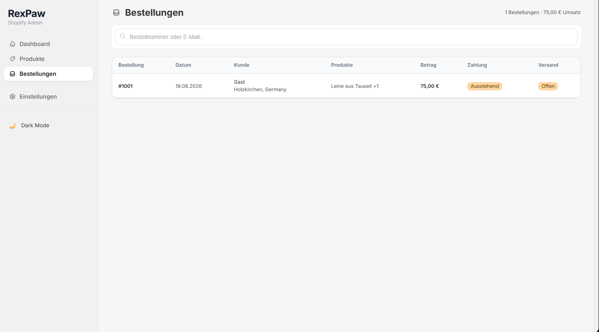
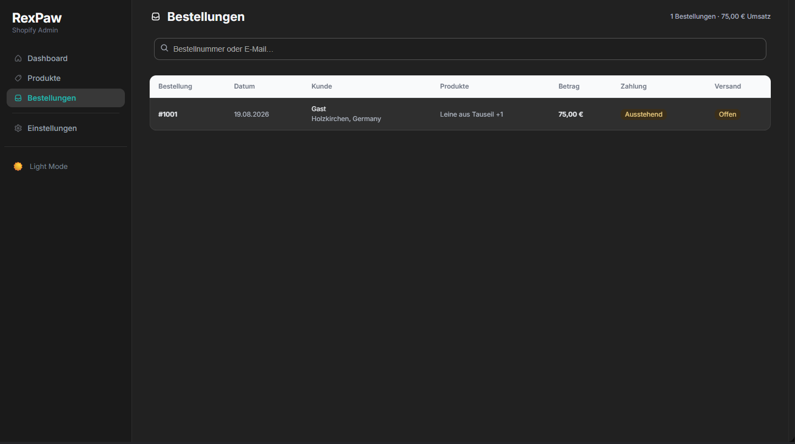

# XPaw Admin

Shopify Embedded Admin App — entwickelt als Portfolio-Projekt zur Erweiterung meiner Kenntnisse in der Shopify App-Entwicklung. Die App ersetzt und erweitert das Standard-Shopify-Backend für Produktverwaltung, Bestellungen und Analyse.

---

## Screenshots

| Light | Dark |
|-------|------|
|  |  |
|  |  |
|  |  |
|  |  |

---

## Features

### Produkte
- Produktliste mit Infinite Scroll / Pagination (wechselt automatisch ab 100+ Produkten)
- Inline-Titelbearbeitung direkt in der Liste
- Erweiterte Filterleiste mit Filter-Pills (Status, Kollektion, Tags, Varianten, Sale, Lagerbestand)
- Bulk-Bearbeitung (Delete mit Undo, Tags hinzuf&uuml;gen/entfernen, Kollektionen zuweisen)
- CSV-Export, CSV-Import (geplant)
- Produkt-Detailseite mit vollst&auml;ndiger Bearbeitung:
  - Titel, Beschreibung (Rich Text), Status, Tags
  - Variantenverwaltung (Preis, Vergleichspreis, SKU, Lagerbestand)
  - Bild-Upload, Sortierung per Drag & Drop, L&ouml;schen
  - Metafelder (lesen, erstellen, l&ouml;schen)
  - Kollektionszuweisung

### Kollektionen
- Alle smarten und manuellen Kollektionen auflisten
- Erstellen, bearbeiten, umbenennen, l&ouml;schen
- Produkte direkt aus der Kollektions-Detailseite zuweisen

### Tags
- &Uuml;bersicht aller Produkt-Tags mit Verwendungsanzahl
- Tags &uuml;ber alle Produkte hinweg umbenennen und l&ouml;schen

### Bestellungen
- Bestellliste mit Kunde, Artikel, Zahlungs- und Versandstatus
- Filterleiste mit Filter-Pills (Zahlungsstatus, Versandstatus, Suche)
- Bestell-Detailseite mit vollst&auml;ndiger &Uuml;bersicht, Artikeln mit Produktbildern, Lieferadresse, Tracking

### Dashboard
- KPI-Karten: Produkte gesamt, aktive Produkte, Bestellungen gesamt, offene Bestellungen
- Umsatz-KPIs mit W&auml;hrungsformatierung
- Umsatz-Sparkline (letzte 60 Tage)
- Letzte Bestellungen (anklickbar)
- Top-Produkte nach Umsatz

### Dark Mode
- Vollst&auml;ndiger Dark Mode mit Light Sea Green Akzentfarbe (`#20B2AA`)
- Umschaltbar per Toggle in der Sidebar — Einstellung wird in `localStorage` gespeichert
- Konsistentes Theming &uuml;ber alle Seiten: Sidebar, Tabellen, Formulare, Modals, Badges, Buttons
- Abwechselnde Zeilenf&auml;rbung in allen Listen (Produkte, Kollektionen, Tags, Bestellungen)
- Skeleton-Screens im passenden Dunkelton beim Seitenwechsel
- Polaris-Komponenten vollst&auml;ndig &uuml;berschrieben (TextField, Select, Button, Badge, Tabs)
- Aktiver Sidebar-Eintrag in Akzentfarbe, Hover neutral-grau

---

## Tech Stack

| Bereich | Technologie |
|---|---|
| Framework | [React Router v7](https://reactrouter.com/) (Remix-style SSR) |
| Shopify-Integration | [@shopify/shopify-app-react-router](https://github.com/Shopify/shopify-app-js) |
| UI-Komponenten | [Shopify Polaris](https://polaris.shopify.com/) |
| API | Shopify Admin GraphQL API (2025-10) |
| Authentifizierung | App Bridge JWT, OAuth |
| Session-Speicher | Prisma + SQLite |
| Build-Tool | Vite |
| Laufzeitumgebung | Node.js |

---

## Architektur

- **Loader/Action-Pattern** — alle Datenbankabfragen und Mutationen laufen serverseitig in Loadern und Actions; der Client bleibt schlank
- **Einmaliger `authenticate.admin`-Aufruf pro Route** — der Admin-Client wird einmal pro Request erstellt und an spezialisierte Handler-Module weitergegeben
- **`shouldRevalidate`** im Root-Layout verhindert doppelten JWT-Verbrauch bei clientseitiger Navigation (bekanntes Problem mit Shopify App Bridge)
- **Context + Custom Hooks** — Produktzustand, CRUD, Massenl&ouml;schung, Metafelder, Filter und Export sind in eigenen Hooks gekapselt (`useProductCRUD`, `useBulkDelete`, `useMetafields`, `useProductFilters`, `useExport`)
- **Progressive Loading** — Skeleton-Screens beim Seitenwechsel; bei Filter&auml;nderungen bleibt der bestehende Inhalt sichtbar (kein Wei&szlig;-Aufblitzen)
- **Portal-basierte Overlays** — Filter-Dropdowns werden per `ReactDOM.createPortal` in `document.body` gerendert, um Stacking-Context-Probleme innerhalb von Polaris-Cards zu vermeiden

---

## Lokale Entwicklung

```bash
# Abh&auml;ngigkeiten installieren
npm install

# Shopify Dev-Server starten (Tunnel + OAuth)
shopify app dev --config rexpaw-admin

# Beim ersten Start oder nach Scope-&Auml;nderungen
shopify app dev --config rexpaw-admin --reset
```

Ben&ouml;tigte Scopes (in `shopify.app.rexpaw-admin.toml`):
```
write_products, read_products, write_metaobjects, write_metaobject_definitions,
read_locations, read_inventory, write_inventory,
read_orders, write_orders, read_customers, write_customers,
read_fulfillments, write_fulfillments, read_analytics
```

---

## Status

Aktiv in Entwicklung — Portfolio-Projekt.  
Geplant: Kundenverwaltung, standort&uuml;bergreifende Inventarbearbeitung, erweiterte Dashboard-Analysen, vollst&auml;ndiger CSV-Import.
